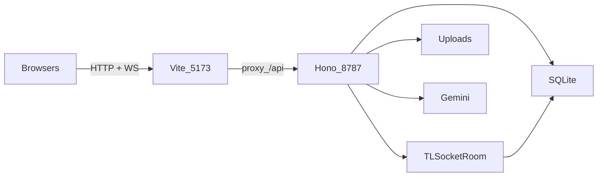
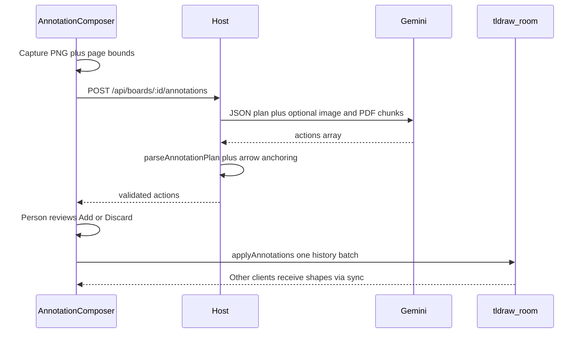

# Interactive Whiteboard

A LAN-collaborative study whiteboard: several people draw on one durable board, upload course PDFs, and ask a host-funded AI tutor about both the live drawing and the documents.

🧠 Shared rooms, 📚 grounded citations, and 🎨 review-then-apply AI notes — on your LAN, with the provider key staying on the host.

This repository is a portfolio system around [tldraw](https://tldraw.dev). **tldraw owns the editor, shape model, undo/redo, camera, presence, and WebSocket sync engine.** This repo owns hosting, durable rooms, guest access, PDF ingestion, retrieval, multimodal tutoring, usage limits, and schema-validated AI annotations.

---

> **For AI agents starting here:** this README is the source of truth. Do not present tldraw’s editor or sync as original work. Do not invent latency, retrieval, or reliability numbers — cite [`docs/evaluation.md`](docs/evaluation.md) and [`docs/reliability.md`](docs/reliability.md). Never commit `.env`, `data/`, `PLAN.md`, `HANDOFF.md`, or `node_modules`. Provider keys stay on the host.

---

## Contents

- [What it does](#what-it-does)
- [Demo workflow](#demo-workflow)
- [Architecture](#architecture)
- [AI pipelines](#ai-pipelines)
- [Trust model](#trust-model)
- [Challenges](#challenges)
- [Measured results](#measured-results)
- [Local setup](#local-setup)
- [Scripts and CI](#scripts-and-ci)
- [Repository map](#repository-map)
- [API](#api)
- [Conventions for future work](#conventions-for-future-work)
- [Known limitations](#known-limitations)
- [Attribution](#attribution)

---

## What it does

| Capability | What you actually get |
| --- | --- |
| Shared board | Two (or more) browsers join `/board/:boardId`, draw concurrently, see cursors/presence, and converge on one room |
| Persistence | tldraw snapshots debounce into SQLite; a host restart restores shapes and uploaded files |
| Course PDFs | Either participant uploads a PDF; the host extracts page-aware text, chunks it, embeds it, and shares processing status |
| Grounded tutor | Streaming chat with recent turns, retrieved passages, and an optional PNG of the board; answers show page citations |
| AI annotations | The tutor proposes up to four notes, labels, arrows, or highlights; a person reviews them, then one undoable batch lands on the shared board |
| Host vs guest | The creator gets an admin secret and usage dashboard; guests never see the Gemini key |
| LAN join | Dev server binds `0.0.0.0`; the dashboard copies an IPv4 guest link for another device on the same network |

The visual identity is dark and floating (`bg-slate-950`, cyan→violet actions, `focus:ring-2 focus:ring-cyan-500`). Keep that when touching UI.

---

## Demo workflow

The product is “working” when this loop succeeds:

1. Two browsers join one board and edit at the same time.
2. Either person uploads a PDF. After a refresh or host restart, the board and file are still there.
3. Someone asks a typed question about the drawing **and** the document. The tutor streams an answer with a real page citation.
4. The tutor can also propose notes / arrows / highlights. Applying them syncs to every client. One Undo removes the whole AI set.

Development uses two windows on one machine. A LAN demo uses two physical devices on the same network (plain HTTP is expected).

A narrated 60–90s clip is still a packaging leftover if it is not linked here yet. Do not claim a public demo video exists unless a file or URL is added.

---

## Architecture

```text
Browser(s)  --HTTP + WS-->  Vite :5173 (dev proxy of /api)
                                |
                                v
                           Node host :8787  (Hono)
                                |
         +----------------------+----------------------+
         |                      |                      |
   TLSocketRoom           SQLite (data/)         Gemini (server-only)
   one per boardId        boards, snapshots,     chat + embeddings
                          files, chunks,         key never leaves host
                          messages, citations,
                          usage
         |
   data/uploads/<boardId>/...
```



### Runtime split

| Mode | Who serves the UI | Who serves `/api` and `/api/sync` |
| --- | --- | --- |
| `npm run dev` | Vite on `0.0.0.0:5173`, proxies `/api` (including WebSocket upgrade) to `:8787` | `tsx server/index.ts` on `0.0.0.0:8787` |
| `NODE_ENV=production` + `npm start` | Same Node process serves `dist/` | Same process |

Frontend: React 18, Vite 6, TypeScript, Tailwind 4, React Router 7, tldraw 5.4.  
Host: Node, Hono, `@hono/node-ws`, `better-sqlite3`, `@google/generative-ai`, `pdf-parse`.

### What this repo owns vs tldraw

| tldraw | This repository |
| --- | --- |
| Infinite canvas, tools, selection, transforms | Board rooms keyed by UUID, SQLite snapshots |
| Undo/redo, camera, serialization, PNG export | Guest token = board id; hashed admin secret |
| `useSync` / `TLSocketRoom` CRDT-style sync, presence, reconnect | PDF upload, extract, chunk, embed, search |
| Native toolbar (kept) | Streaming tutor context assembly + SSE |
| | Schema-validated annotation actions applied as one history batch |
| | Rate limit, spend cap, named failure states, LAN join URL |

[`src/app/components/Board.tsx`](src/app/components/Board.tsx) is a thin wrapper: hide chrome that collides with this app’s panels, swap the style panel, register a size-aware eraser.

### Persistence

- In-memory `TLSocketRoom` per board in [`server/rooms.ts`](server/rooms.ts).
- Snapshot write is **debounced 1.5s** on data change.
- Flush immediately when the last session leaves.
- Flush all rooms on `SIGINT` / `SIGTERM`.
- After a last edit, wait ~2s before killing the process in tests, or the debounce can miss the last strokes.

### Data model

SQLite at `data/whiteboard.sqlite` (gitignored). Schema: [`server/db.ts`](server/db.ts).

| Table | Role |
| --- | --- |
| `boards` | id, title, `admin_secret_hash` |
| `board_snapshots` | tldraw room JSON blob + version |
| `files` | upload metadata, `processing` / `ready` / `error` |
| `chunks` | page-aware text + optional embedding JSON |
| `messages` | one shared thread per board (`user` / `assistant` / `error`) |
| `citations` | denormalized filename/page/excerpt so old answers survive file delete |
| `usage` | estimated tokens/cost/latency per model call (not a bill) |

Uploads live on disk at `data/uploads/<boardId>/`. Deleting a file removes the asset and cascaded chunks. Citations keep the excerpt they already showed.

Pasted images on the canvas use tldraw’s `inlineBase64AssetStore` (embedded in shape records). That is enough for a demo, not a real asset CDN.

---

## AI pipelines

One configurable multimodal chat model and one embedding model. Defaults live in [`server/ai/config.ts`](server/ai/config.ts) and can be overridden by env (`GEMINI_CHAT_MODEL`, `GEMINI_EMBEDDING_MODEL`). Do not scatter hard-coded model names through new code.

### Document ingest and retrieval

1. `POST /api/boards/:id/files` — PDF only, 20 MB, 20 files per board.
2. [`server/ingestion.ts`](server/ingestion.ts) — `pdf-parse` → per-page text → [`server/chunking.ts`](server/chunking.ts) (~900 chars, 150 overlap, word-boundary splits).
3. [`server/ai/embeddings.ts`](server/ai/embeddings.ts) — batch embed; if no key, embeddings are `null` and search uses keyword overlap.
4. Empty extractable text (typical scanned PDF) → `error` with a readable message. OCR is out of scope.
5. Clients poll file status so every participant sees `processing` / `ready` / `error`.

[`server/search.ts`](server/search.ts) scores cosine similarity in-process (no separate vector DB). Overview questions (“what is this lecture about?”) take extra chunks, prefer intro/content pages, and skip exam/grading logistics slides.

Offline eval fixture: [`eval/Linear_Algebra_Ch3.pdf`](eval/Linear_Algebra_Ch3.pdf) + [`eval/questions.json`](eval/questions.json) (15 page-grounded + 1 off-topic). Runner: `npm run eval:retrieval`.

### Grounded chat

[`server/chat.ts`](server/chat.ts) orchestrates one turn:

1. Reject if no key / rate-limited / over board budget / snapshot too large.
2. Store the user message.
3. Retrieve top-k chunks (k=5) for this board only.
4. Build Gemini contents: tutoring system prompt, last 8 non-error turns, numbered source block, optional board PNG.
5. Stream tokens as SSE (`token` | `done` | `error`).
6. Store assistant text, citations (the retrieved chunks, denormalized), and usage.

The UI is [`src/app/components/ChatPanel.tsx`](src/app/components/ChatPanel.tsx). Stop uses `AbortController`. Timing logs appear in the browser console as `[chat timing]`.

Displayed citations are the chunks **included in the request**, not only markers the model wrote as `[n]`. That matches the plan’s “chunk was in context” rule. There is no in-app PDF page viewer.

Chat history is loaded with `GET /api/boards/:id/messages`. It is **not** live-synced across tabs; a second tab sees new turns after reload (or after opening the panel if it refetches).

### AI board annotations

Propose → validate → review → apply. The **server never mutates the canvas**.



- Allowed actions only: `note`, `text`, `arrow`, `highlight` — max 4. Coordinates are 0–1 relative to the captured bounds. Schema: [`shared/annotationSchema.ts`](shared/annotationSchema.ts).
- PDF takeaway prompts force the first note to be the main point and bind the arrow to it ([`anchorPdfTakeawayArrows`](shared/annotationSchema.ts)). Geometry may reverse a tail that points the wrong way ([`shared/annotationGeometry.ts`](shared/annotationGeometry.ts)).
- Output token limit is 4096. If a PDF-grounded image response is invalid JSON, the host retries once **without** the board image.
- Apply ([`src/app/annotations.ts`](src/app/annotations.ts)): notes as wide geo rectangles, highlights as translucent yellow, star marker on notes/text/arrow labels, one `editor.run` + `squashToMark` so a single Undo drops the batch. Notes are created before arrows so `targetNoteIndex` bindings exist.

Tests: `npm run test:annotations` (schema + geometry only — no HTTP or UI tests).

---

## Trust model

Treat dorm / school / shared Wi-Fi as untrusted. Hiding a button is not authorization.

| Rule | Implementation |
| --- | --- |
| Board URL is the guest token | `/board/<uuid>` — anyone with it can draw, upload, delete files, and chat |
| Admin secret is one-time | Minted on `POST /api/boards`, SHA-256 hashed in SQLite, stored in creator `localStorage` as `whiteboard:admin-secret:<boardId>` |
| Admin-only routes | `DELETE /api/boards/:id` and `GET /api/boards/:id/usage` require `x-admin-secret` (timing-safe compare) |
| Keys never leave the host | `/api/config` returns `{ aiConfigured, lanIPv4 }` only. No key in bundles, logs, SSE, or WS payloads |
| Upload limits | PDF MIME/type, 20 MB, 20 files/board |
| Chat / annotation limits | 4000-char chat cap; annotation instruction 1–600 chars; in-memory per-board rate limit; per-board USD budget (defaults in `server/ai/config.ts`) |
| Failures are named | `no_api_key`, `rate_limited`, `budget_exceeded`, `model_failed`, `cancelled`, `unsupported_type`, scanned-PDF error, etc. |

Creating a board on PC A does **not** make you host on PC B. Admin recognition is per browser. Display names use `wb:name:<boardId>` in `localStorage`.

---

## Challenges

These are the hard parts of the project — useful when explaining it, and useful when changing it.

### 1. Shared state, not a drawing toy

The interesting problem is one authoritative room, several clients, and durability across refresh, reconnect, and process restart. tldraw solves concurrent editing; this repo has to **own the room map, snapshot contract, and shutdown flush** so “reload” and “restart the host” do not lose confirmed work.

### 2. Host-funded AI on an untrusted LAN

Guests must use the tutor without ever receiving `GEMINI_API_KEY`. That forced a server-side provider, a boolean `aiConfigured` flag instead of a client key field, hashed admin secrets, rate limits, and a spend cap. The board id is still a capability URL: secrecy of the link is the guest ACL.

### 3. Grounding without a PDF viewer

The tutor has to talk about a **drawing and a document in one request**. The practical design is: PNG snapshot of the board + retrieved page chunks + citations that map to chunks actually sent. There is no in-app page renderer; citations show filename, page, and excerpt.

### 4. Retrieval quality on messy lecture decks

Semantic search on “what is this lecture about?” latches onto exam/grading slides. Overview detection in [`server/search.ts`](server/search.ts) widens k, boosts intro pages, and down-ranks logistics. The eval fixture still has one known miss: the off-topic “boiling point of water on Mars” scores ~0.51 against a notional reject threshold of 0.2.

### 5. Structured board actions from a multimodal model

Free-form model output is unsafe on a shared canvas. The contract is a **tiny JSON schema**, server-side parse, human review, then a client apply path that only creates four shape kinds. Real issues that already shaped the code:

- Empty plans when the PDF was not visible on the board → prompt now allows notes + arrows between new notes.
- JSON cut off mid-object at 1,600 output tokens → limit raised to 4,096; PDF plans retry without the image.
- Dotted arrows into empty space → takeaway note is first; arrow is anchored and may be reversed; tip binds to the note.

### 6. LAN and Windows reality

Plain HTTP on a LAN IP is not a secure browser context (no guest microphone — voice is deferred). Windows Firewall and client-isolation Wi-Fi can block guests. `LAN_IPV4` overrides a wrong VPN adapter. `better-sqlite3` is a native addon: Node 24 on this Windows setup lacked a prebuild; **Node 22 LTS** installed cleanly.

### 7. Attribution honesty

A recruiter-facing README that claimed “we built a CRDT whiteboard” would be false. The portfolio story is the surrounding system: rooms, ingest, retrieval, tutor context, limits, and bounded AI actions.

---

## Measured results

Recorded **2026-09-17**, Windows, two **localhost** tabs, `gemini-3.8-flash` + `gemini-embedding-001`. Full write-up: [`docs/evaluation.md`](docs/evaluation.md), [`docs/reliability.md`](docs/reliability.md). Re-run retrieval after chunk/embed changes: `npm run eval:retrieval`.

| Area | Result |
| --- | --- |
| Retrieval | **15/16 (94%)** — miss is the intentional no-source question (still scored 0.51) |
| Chat TTFB | n=3; 1999 / 2169 / 2360 ms (min / median / max) |
| Chat total | server `latencyMs` median **2280 ms** |
| Sync | visual, 5 short strokes; perceived under ~100 ms; no duplicate shapes observed |
| Reliability pass | concurrent edits, PDF ingest + `.txt` reject, refresh + host restart, board+doc chat + Stop, `no_api_key` / rate limit / budget, usage 403, host vs guest dashboard |
| Reliability skipped | isolated WebSocket drop, oversized PDF, one-page scanned fixture |

LAN: Vite advertised `http://192.168.10.132:5173/`; same-machine requests hit the app, `/api/health`, board create, and sync `Open`. The dashboard guest link later opened on a second physical device; two-way edits / presence / reconnect on that pair were not separately written down.

---

## Local setup

### Requirements

- Node **22 LTS** recommended on Windows (`better-sqlite3` prebuilds). Node 24 may need Visual Studio C++ tools + Windows SDK if no matching binary exists.
- A Gemini API key from [Google AI Studio](https://aistudio.google.com/apikey) (optional: without it, chat/annotations are disabled and search falls back to keywords).

### Run

```bash
git clone https://github.com/11samm/InteractiveWhiteBoard.git
cd InteractiveWhiteBoard
npm i
cp .env.example .env   # Windows: copy .env.example .env
# paste GEMINI_API_KEY into .env
npm run dev
```

- Client: http://localhost:5173 (proxies `/api` and the sync WebSocket)
- Host: http://localhost:8787 — `GET /api/health` → `{ "ok": true }`

Restart the host after any `.env` change (`process.loadEnvFile` runs at process start).

### Environment

See [`.env.example`](.env.example). Common knobs:

```env
GEMINI_API_KEY=
# LAN_IPV4=192.168.1.100
# GEMINI_CHAT_MODEL=gemini-3.8-flash
# GEMINI_EMBEDDING_MODEL=gemini-embedding-001
# CHAT_MAX_REQUESTS_PER_WINDOW=8
# CHAT_WINDOW_MS=300000
# CHAT_BUDGET_USD_PER_BOARD=1.0
```

`.env`, `data/whiteboard.sqlite`, and `data/uploads/` are gitignored and **do not travel** with a clone.

### Two-device LAN

1. Host machine: `npm run dev` (both Vite and the API bind `0.0.0.0`).
2. Create a board; open Host dashboard; copy the IPv4 join link.
3. Guest: same Wi-Fi, not client-isolated; allow Node/Vite through Windows Firewall if needed.
4. If the link is the wrong adapter, set `LAN_IPV4`.

---

## Scripts and CI

| Command | What it does |
| --- | --- |
| `npm run dev` | Vite client + `tsx server/index.ts` |
| `npm run typecheck` | `tsc` for `tsconfig.json` and `tsconfig.server.json` (strict) |
| `npm run build` | Typecheck + Vite production bundle |
| `npm start` | Host only; serves `dist/` when `NODE_ENV=production` |
| `npm run test:annotations` | Schema and geometry unit tests |
| `npm run eval:retrieval` | Ingest fixture PDF, score `eval/questions.json` (needs a provider key for semantic mode) |

GitHub Actions ([`.github/workflows/ci.yml`](.github/workflows/ci.yml)): Node 22, `npm ci`, typecheck, annotation tests, build. Retrieval eval is **not** in CI (no provider key).

---

## Repository map

```text
src/app/                 React UI
  App.tsx                Routes: /, /board/:boardId, /host/:boardId?
  routes/                Home, board (useSync), host dashboard
  components/            Board, chat, annotate, files, chrome
  annotations.ts         Capture bounds + apply one undo batch
  lib/api.ts             REST, SSE, admin secret, LAN join origin
  tldraw/                Custom eraser tool + size
server/                  Node host
  index.ts               Hono routes, SSE, WS upgrade, static dist
  rooms.ts               TLSocketRoom map + persist
  db.ts                  SQLite schema
  chat.ts                One grounded turn
  ingestion.ts           PDF pipeline
  search.ts              Cosine / keyword + overview coverage
  ai/                    Gemini chat, embeddings, annotations, config
  lan.ts                 Private IPv4 for join links
shared/                  Annotation schema + geometry (client + server)
eval/                    Retrieval fixture + questions
scripts/                 Eval runner, fixture generator
docs/                    Measured evaluation and reliability notes
```

| File | Role |
| --- | --- |
| [`src/app/routes/BoardPage.tsx`](src/app/routes/BoardPage.tsx) | `useSync`, presence, reconnect banner, floating chrome |
| [`src/app/components/StudyContextSidebar.tsx`](src/app/components/StudyContextSidebar.tsx) | PDF upload, shared status, delete |
| [`src/app/components/AnnotationComposer.tsx`](src/app/components/AnnotationComposer.tsx) | Prompt, review, apply/discard |
| [`src/app/routes/HostSetupPage.tsx`](src/app/routes/HostSetupPage.tsx) | LAN join URL, AI status, usage (creator browser only) |
| [`server/boards.ts`](server/boards.ts) | Create/get/delete board, admin check |
| [`server/files.ts`](server/files.ts) / [`server/messages.ts`](server/messages.ts) / [`server/usage.ts`](server/usage.ts) | Persistence helpers |
| [`server/rateLimit.ts`](server/rateLimit.ts) | In-memory per-board chat/annotation window |
| [`server/secrets.ts`](server/secrets.ts) | Random admin token, SHA-256, timing-safe compare |

---

## API

All HTTP under `/api`. In dev, the browser talks to Vite; Vite proxies here.

```text
POST   /api/boards
GET    /api/boards/:id
DELETE /api/boards/:id                 admin
GET    /api/config                     { aiConfigured, lanIPv4 }

GET    /api/boards/:id/files
POST   /api/boards/:id/files           multipart field "file"
GET    /api/files/:id/status
DELETE /api/files/:id

POST   /api/boards/:id/search          debug / eval
GET    /api/boards/:id/messages
GET    /api/boards/:id/usage           admin
POST   /api/boards/:id/chat            SSE: token | done | error
POST   /api/boards/:id/annotations     JSON proposal; client applies

WS     /api/sync/:boardId
GET    /api/health
```

**Chat body:** `{ message, boardImage? }` (base64 PNG).  
**Annotation body:** `{ instruction, boardImage? }`. Success `{ actions }`. Does not write shapes. Shares the chat rate limit and board spend budget. `409 source_unavailable` when a PDF-grounded request has nothing to retrieve.

---

## Conventions for future work

1. **TypeScript strict** on both tsconfigs. Run `npm run typecheck` after server or client changes.
2. **Provider keys only on the host.** No key inputs in the UI. Never log raw keys or document text in new logging.
3. **Named user-facing failures**, not silent empty chat or empty annotate.
4. **Do not rebuild tldraw.** Custom tools/chrome only when the native control collides or lacks a needed affordance (eraser size is the existing example).
5. **Annotation actions stay bounded.** No arbitrary editor commands, no delete-all, no executing model-supplied code.
6. **Do not invent metrics.** If you change chunking, embeddings, or chat, re-run eval and update `docs/` with method and sample size.
7. **Do not implement** voice, OCR, extra providers, public cloud hosting, or a visual redesign unless the owner asks.
8. **Keep docs truthful.** If behavior is unverified on two devices, say so.

UI: match existing dark floating surfaces. Primary buttons stay cyan→violet. Interactive controls need visible focus rings.

---

## Known limitations

- No OCR — scanned/image-only PDFs fail clearly.
- No voice (LAN HTTP is not a secure context for guest microphones).
- Chat thread is not live-replicated across tabs.
- Citations list retrieved context, not model-highlighted spans only.
- Apply uses **capture-time** page bounds; pan/zoom before “Add to board” can misplace shapes.
- Empty `{"actions":[]}` is schema-valid; the composer shows a notice.
- `inlineBase64AssetStore` for pasted images — fine for demo.
- tldraw production deployments need a [license key](https://tldraw.dev/community/license); this project currently passes none (`<Tldraw />` in `Board.tsx`). Dev/localhost is the expected demo.
- Reliability rows for isolated WS drop, oversized PDF, and scanned fixture were **skipped**, not passed.
- Off-topic retrieval still returns a mid-range cosine score instead of a hard no-hit.

---

## Attribution

UI origin: Figma Make dark-mode whiteboard mock, then rebuilt around tldraw + a Node host. Details: [`ATTRIBUTIONS.md`](ATTRIBUTIONS.md).

- **tldraw SDK** — editor and sync. License: [tldraw license](https://tldraw.dev/community/license). Production use needs a trial, hobby, or commercial key; hobby keeps the “made with tldraw” watermark.
- **shadcn/ui** — MIT.
- **Gemini** — host-configured API; not bundled.

This is a personal portfolio project, not a hosted multi-tenant product. Out of scope: billing, accounts, LMS integrations, native mobile clients, and global multi-region hosting.
